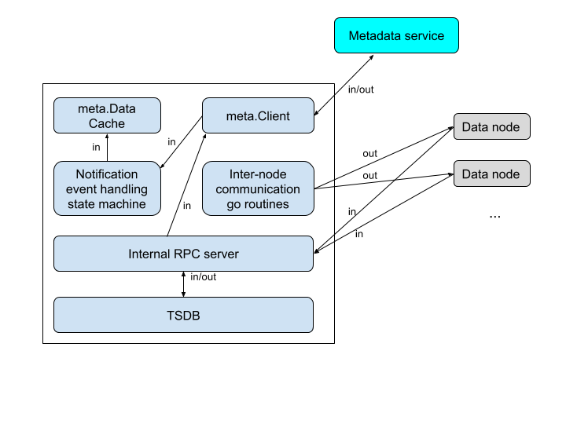
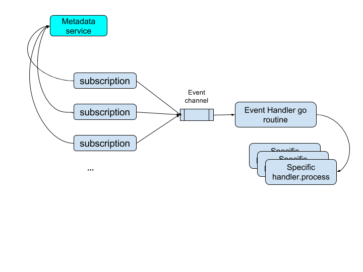
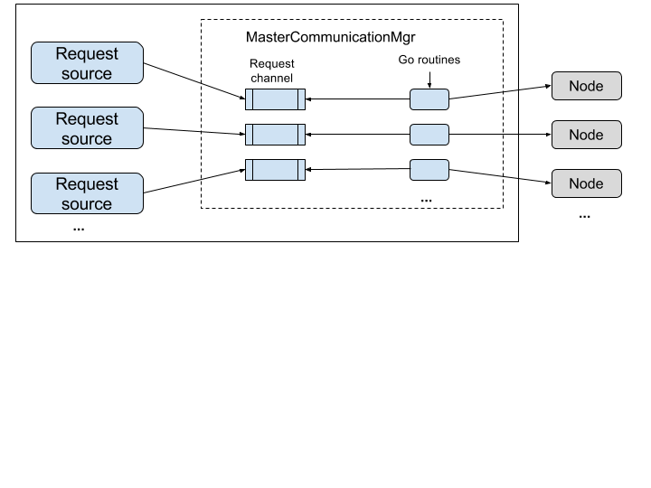

## Master's key functionalities
1. Manipulate metadata by communicating to metadata service (etcd).
2. Caching all metadata in memory (populate from metadata service when starts up. And sync all metadata to other data nodes in cluster.
3. Subscribe metadata service's session expiration, data change notifications. Do relection, refresh the in-memory metadata cache according to subscriptions and re-sync to other data nodes in cluster.

## High level arch
There are several componenets in high level

1. meta.Client which reads/writes metadata from/to metadata service and validate in-memory metadata cache.
2. Etcd event subscription and correpsonding event handling state machine.
3. Master inter-node communication component which sends metadata sync etc requests to other data nodes in the cluster.
4. Intrnal RPC server which accepts other nodes' requests. Internal RPC server is common to master and non-master nodes.

## Etcd events handling
Key design idea here is all events are enqueued and then dequeued and handled by a single gorouine to simplify the event ordering handling. So event handler should be implemented as fast/light as possible to avoid blocking the event dequeue/handling go routine.

## Master -> Other nodes
Key design idea here is introducing a CommunicationMgr in master. Clients can send requests to CommunicationMgr if clients would like to communicate to other data nodes. Internally CommunicationMgr will enqueue the requests to the corresponding internal message queue and a dedicated goroutine which waits for the message queue will dequeue the request and then invoke internal RPC to communicate remote data node.

